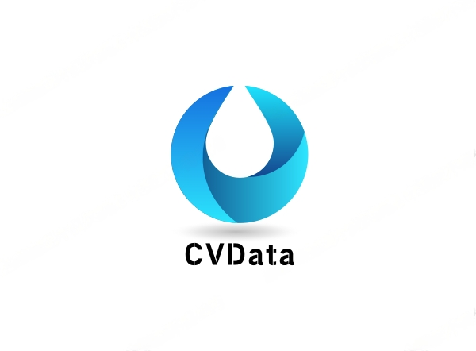

## 简介
CVData是一个cv领域的数据处理工具箱，可以对图像进行预标注等数据转换功能。目前主要用来做数据预标注和自定义数据格式转换。目前支持的预标注功能有：
- **目标检测预标注**
- **分类预标注**
- **跟踪预标注**
- **分割预标注**
- 前面几种的**组合预标注**

此外还可以自定义数据格式转换。

## 安装
```sh
git clone https://github.com/ThistleInTheSun/CV_Data_Prcoessing.git
cd CV_Data_Processing
python setup.py install
```
开发者安装时，建议采用
```sh
python setup.py develop
```

## 快速入门
```python
from cvdata import pre_label

img_root = "./test/test_img_dir"
json_save_path = "./test/gen_json_dir"
pre_label(
    img_root, json_save_path, 
    label="sleeping", is_track=True)

```
