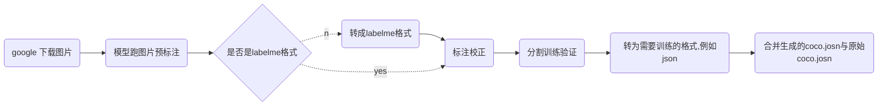

背景：
模型落地过程中，需要针对模型badcase收集特定场景的图片进行加强训练。下面记录了这个迭代的过程与工具的使用方法，主要包括收集数据、模型预标注、校正标注、转为训练格式。



# google 下载图片
**安装：**
+ 根据教程~/ScriptCollection/labels/Image-Downloader/README.md 下载对应版本的chrome driver；
+ 下载成功后，放在~/ScriptCollection/labels/bin/目录下；
**批量下载：**
例如，下载一批关键词为"人体工学椅"的图片，并存进名为data_ergonomic_chair的文件夹。
```sh
python ~/ScriptCollection/labels/Image-Downloader/image_downloader.py \
"椅背外套" \
--max-number 10000 \
--output data_ergonomic_chair \
--driver chrome_headless \
--timeout 500
```
设置了最大1w张图片，通常情况下仅能下载到1k张左右的图片。

# coco2labelme
```sh
root = ...
name="data_ergonomic_chair"
python ~/ScriptCollection/labels/coco2labelme.py \
--j ${root}/${name}.json \
--i ${root}/${name} \
--s ${root}/${name}_labelme;
```

# rename
```sh
root="/dataset/object_detection/coco_wider_pedestrian/phone_record"
name_list=( \
    "yizi1_c" \
    "yizi3_c" \
    "yizi5_c" \
    "yizi6_c" \
    "yizi8_c" \
    "yizi10_c" \
    )
# name_list=( \
#     "yizi2_c_test" \
#     "yizi4_c_test" \
#     "yizi7_c_test" \
#     "yizi9_c_test" \
#     )
for name in ${name_list[*]};  
do  
python ~/ScriptCollection/labels/rename.py \
--src_dir ${root}/${name} \
--trg_dir ${root}/train \
--name clothes_${name}
done
```

# split train and val
```sh
root = "/dataset/object_detection/coco_wider_pedestrian"
python ~/ScriptCollection/labels/split_trainval.py \
--img_ann_dir ${root}/data_ergonomic_chair \
--img_type ergonomic_chair \
--train_path ${root}/train \
--val_path ${root}/val \
--rate 0.667 \
--is_shuffle false
```

# labelme2coco
```sh
# classes_file | classes_file_pets
obj_mode="phone_record/val"
root="/dataset/object_detection/coco_wider_pedestrian"
python ~/ScriptCollection/labels/labelme2coco.py \
--labelme_path ${root}/${obj_mode} \
--classes_file ${root}/google_images/classes_file.json \
--save_file ${root}/${obj_mode}.json \
# --start_list half_ office_ sideways_ chair_ garbage_ ergonomic_
done

'''classes_file.json
{"1":"pedestrain"}
'''
```

# combine_coco
```sh
root="/dataset/object_detection/coco_wider_pedestrian/google_images/add_json"
python ~/ScriptCollection/labels/combine_coco.py \
--coco1 ${root}/add_train_person_2022-11-10.json \
--coco2 ${root}/add_train_person_ergonomic_chair.json \
--res_coco ${root}/add_train_person_2022-11-22.json
```

# balance coco
```sh
# train:2500 | val:800
python ~/ScriptCollection/labels/balance_coco.py \
--gt_path /dataset/object_detection/coco_wider_pedestrian/google_images/add_json/add_train_person_2022-11-22.json \
--each_num 2500
```

# combine_coco
```sh
--coco1 /dataset/object_detection/coco_wider_pedestrian/phone_record/yizi2_c_test_coco.json \
--coco2 /dataset/object_detection/coco_wider_pedestrian/phone_record/yizi4_c_test_coco.json \

root="/dataset/object_detection/coco_wider_pedestrian"
python ~/ScriptCollection/labels/combine_coco.py \
--coco_list ${root}/phone_record/train.json ${root}/annotations/train_person_2022-11-22_balance.json \
--res_coco ${root}/annotations/train_person_2022-12-20_balance.json
```

# get_coco_nums
```sh
# /dataset/object_detection/coco_wider_pedestrian/google_images/add_json
# /dataset/object_detection/coco_wider_pedestrian/annotations
python ~/ScriptCollection/labels/get_coco_nums.py \
--path /dataset/object_detection/coco_wider_pedestrian/google_images/add_json
```

# get_coco_random
```sh
root="/dataset/object_detection/coco_wider_pedestrian"
coco_name="val_person_pets_2022-11-22_balance"
python ~/ScriptCollection/labels/get_coco_random.py \
--gt_path ${root}/annotations/${coco_name}.json \
--num 100 \
--txt_sub ${root}/${coco_name}_100.txt \
--img_root ${root}/val \
--img_sub_dir ${root}/images_${coco_name}_100
```


# json2coco
```sh
dir_name=person_corridor_1
root=/home/sdb1/eval_datasets/video_event/person/${dir_name}
python ./json2coco.py \
--anno_dir ${root}/${dir_name}_anno \
--img_dir ${root}/${dir_name}_img \
--save_file ${root}/${dir_name}_coco.json
```